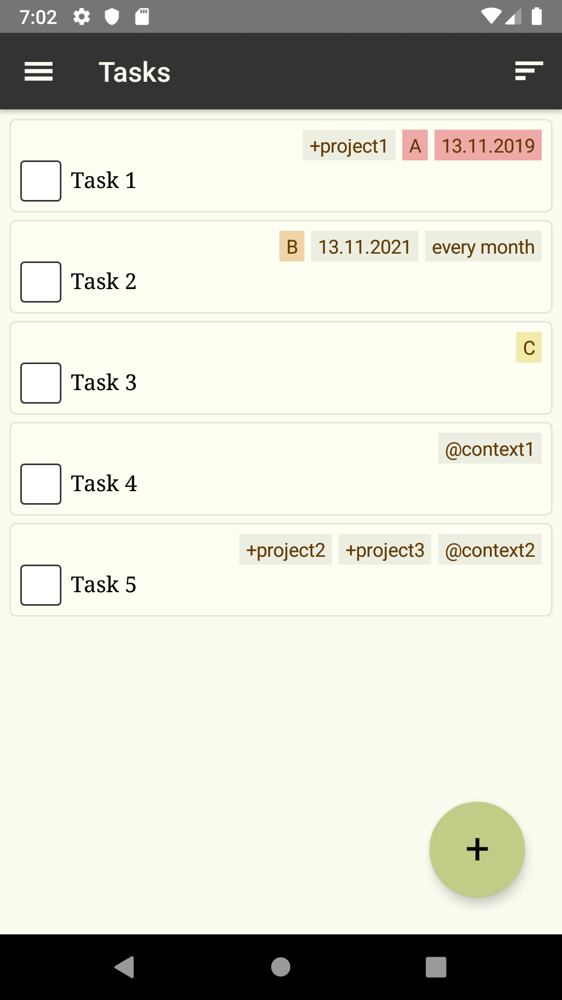
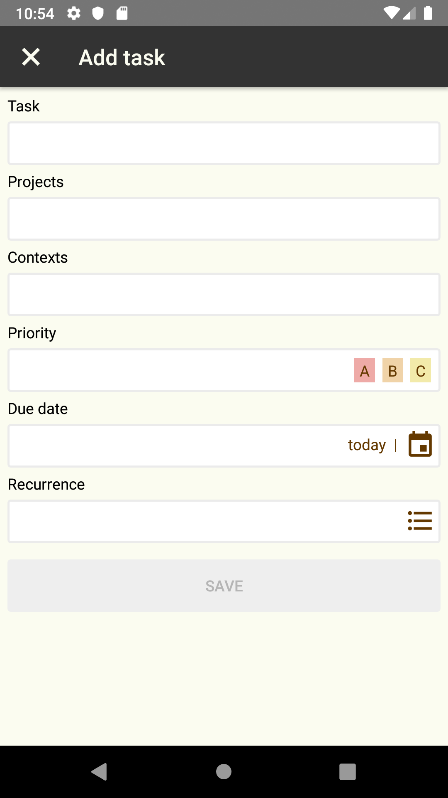

# Mindstream

[](https://github.com/xuhcc/mindstream/releases)
[](https://github.com/xuhcc/mindstream/blob/HEAD/LICENSE)

Task management app that uses [todo.txt](http://todotxt.org/) format.

<a href="https://play.google.com/store/apps/details?id=im.mindstream.mobile"></a>

## Features

- Projects, priorities, due dates.
- Recurring tasks.
- Filtering by project, due date.

### Supported todo.txt extensions:

- Tasks with due date: `due:2019-01-01`.
- Recurrent tasks: `rec:1d` (`d` = day, `w` = week, `m` = month).
- Hidden tasks: `h:1`.

 

## Changelog

See [CHANGELOG](CHANGELOG.md).

## Development

Prerequisites:

* Node.js & NPM
* [NativeScript CLI](https://docs.nativescript.org/angular/start/quick-setup#step-2-install-the-nativescript-cli) 6.1

Install required packages:

```
npm install
```

### Mobile

Run in Android emulator:

```
npm run android
```

Run in iOS emulator:

```
npm run ios
```

### Web

Run in browser:

```
npm start
```

### Testing

```
npm run lint
npm run test
```

## License

[GPL v3](LICENSE)
